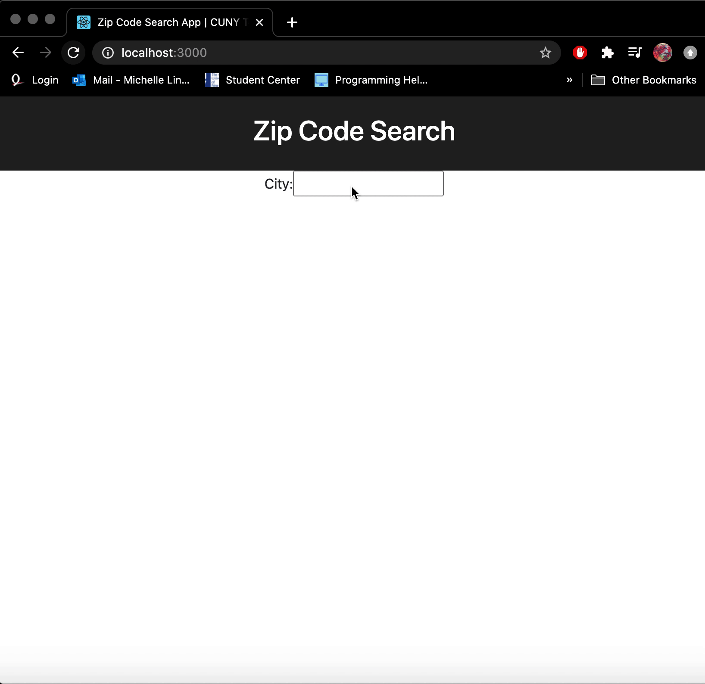

# Zip Code/City Search React Lab

In this exercise, you will create two React apps:

the first app allows users to search by Zip Code and retrieve information about Cities within that Zip Code.
the second app allows the user to search by City name and retrieve that City's related Zip Codes.
To implement these apps, you're given access to a Zip Code API that you can access from your React app. Below is a brief description of how the API works.

## Project 1: Zip Code Search app


## Project 2: City Search app



### Extra credit

- Display all states where the city was found in the API
- Group received zip codes by state
- Display city details for each Zip code

> Note: these will require additional fetch call to the API. Feel free to use your own CSS styles and to add any additional features you want.


## The Zip and City search API documentation (ctp-zip-api)

**API BASE URL:** http://ctp-zip-api.herokuapp.com/

Below is a description of the relevant API endpoints:

> This API has been prebuilt for this assignment.

### Search by Zip Code

* **URL**

  `/zip/:zipcode`

* **Method**

  `GET`

* **URL Params**

  **Required:**

  `zipcode=[alphanumeric]`

* **Data Params**

  None

* **Success Response**

  * **Status Code:** 200

    **Content:**
    ```JSON
    [
        {"RecordNumber":"247","Zipcode":"10018","ZipCodeType":"STANDARD","City":"NEW YORK","State":"NY","LocationType":"PRIMARY","Lat":"40.71","Long":"-73.99","Xaxis":"0.20","Yaxis":"-0.72","Zaxis":"0.65","WorldRegion":"NA","Country":"US","LocationText":"New York, NY","Location":"NA-US-NY-NEW YORK","Decommisioned":"false","TaxReturnsFiled":"4416","EstimatedPopulation":"5928","TotalWages":"810026753","Notes":""},
        { ... },
        ...
    ]
    ```

* **Error Response**

  * **Status Code:** 404

    **Content:** `Not Found`

* **Examples**

  Provide the zipcode in the url and you will receive a JSON response with an array containing an object for each city found. For example see:

  http://ctp-zip-api.herokuapp.com/zip/10016


### Search by City Name

* **URL**

  `/city/:cityname`

* **Method**

  `GET`

* **URL Params**

  **Required:**

  `cityname=[string]`

  > String must be in all uppercase letters

* **Data Params**

  None

* **Success Response**

  * **Status Code:** 200

    **Content:**
    ```JSON
    ["05343","11405","11411","11412","11413", ...]
    ```

* **Error Response**

  * **Status Code:** 404

    **Content:** `Not Found`

* **Examples**

  Provide the city name in the url and you will receive a JSON response with an array containing all zip codes for that city:

  http://ctp-zip-api.herokuapp.com/city/SPRINGFIELD
